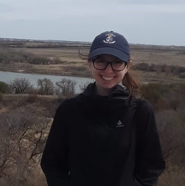
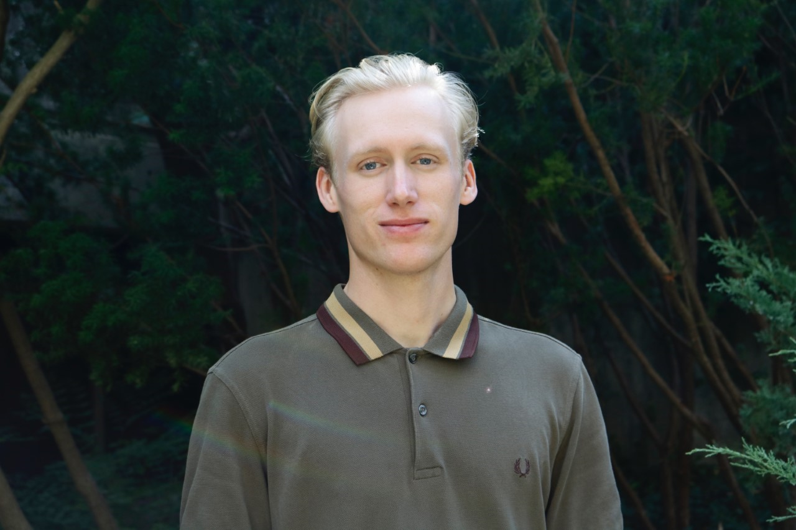

# Accessible Active London

## Team Member Bios

 **Victoria Barlow** is currently in her 4th year of an Honours Specialization in GIS at Western University, and will be continuing on to a MSc in Geography next year. This is her second year being an ECCE student associate. 

 **Jack McIlraith** completed the Honours Geography with Emphasis in GIS program at Trent University, earning a B.Sc. in Geography and an Ontario College Graduate Certificate in Geographical Information Systems - Application Specialist from Fleming College. Jack began his master's studies at Western University in the Geospatial Lab in the fall of 2019. Jack has been an Esri Canada Centres of Excellence Student Associate since the fall of 2019.
