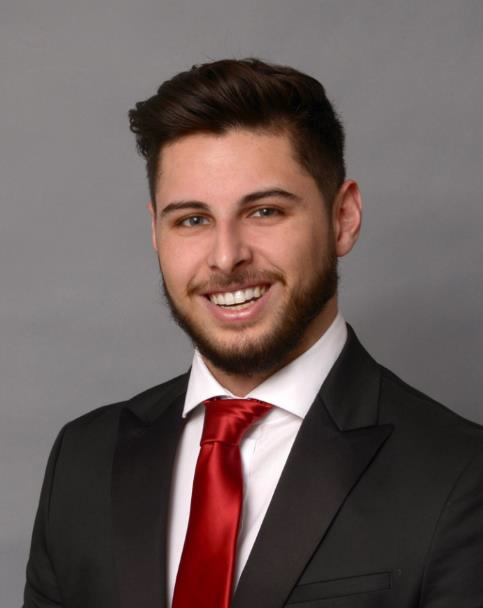
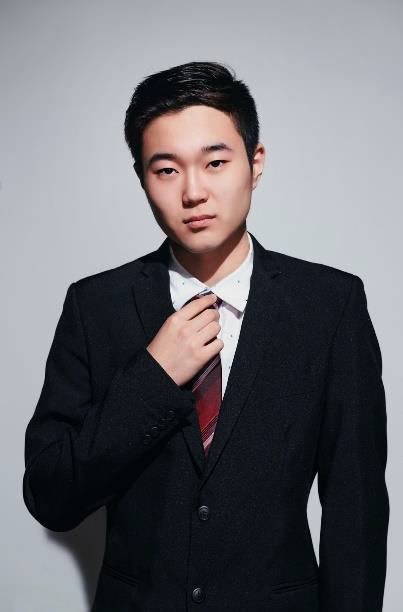

# Anti-Allergy

## Team Member Bios

 **Andrew Sud**: I am a graduating student in the Urban Development Western currently studying as a visiting student at the University of Toronto. I am interested in applying GIS to the development process and using this technology to drive efficiency that is often lacking in the development field. 

 **Xiaoyan (Christine) Cong**: I am a third year student studying geography science and GIS at University of Toronto Mississauga. My interest is doing outdoor geography-related field research with others. Also, incorporating the geography knowledge with GIS can always help me learn more about the research topic that I do. 

 **Tian Ze (Philip) Jia**: I am a second year undergraduate GIS student studying at the University of Toronto Mississauga, my broad research interest is GIS relating to everyday life. My dream is to let more people acknowledge and apply the power of GIS.