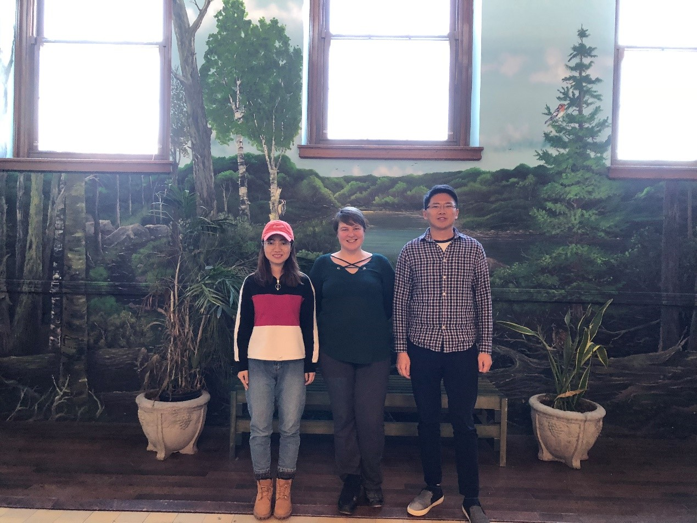

# EcoViewer

## Team Photo

## Team Member Bios

**Kang Liang** (right): Kang is in his final year of his PhD in hydrology in the Faculty of Forestry and Environmental Management at the University of New Brunswick. His research focuses on the evaluation of the impacts of anthropogenic activities on water quality and quantity from field to watershed scale by using hydrological models. He relies on GIS for geospatial analysis and data visualization in his research. He is excited with this opportunity through which he can apply his GIS knowledge as well as push his knowledge forward. In his spare time, Kang enjoys swimming, billiard, hiking, camping and music.

**Heidi Harding** (middle): Heidi is a first year Master of Science in Forestry student. Her research is looking at the availability and usage of nesting habitat by cavity-nesting ducks in the lower Saint John River floodplain. GIS is an integral part of her research, allowing her to identify habitat-level characteristics that may help determine nesting habitat use. Her research is supported by Ducks Unlimited Canada, who will use her results to help inform management and conservation actions. She has a background in biology, education, and technology training, and enjoys reading, painting, and gardening in her free time. 

**Huimin Hao** (left): Huimin is a Master of Science in Forestry in the Faculty of Forestry and Environmental Management at the University of New Brunswick. Her current project is focused on the phenological and morphological response of tree seedlings to drought. She has the basic knowledge of ArcGIS and is interested in it. She hopes to improve her GIS knowledge through this study. In her daily life, she likes watching football matches, listening to music and exercising.