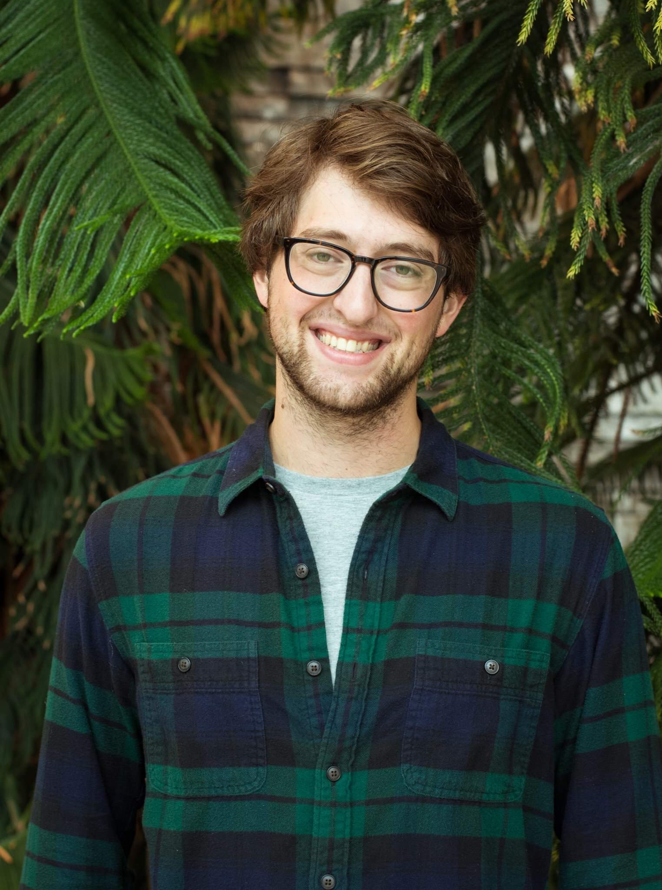
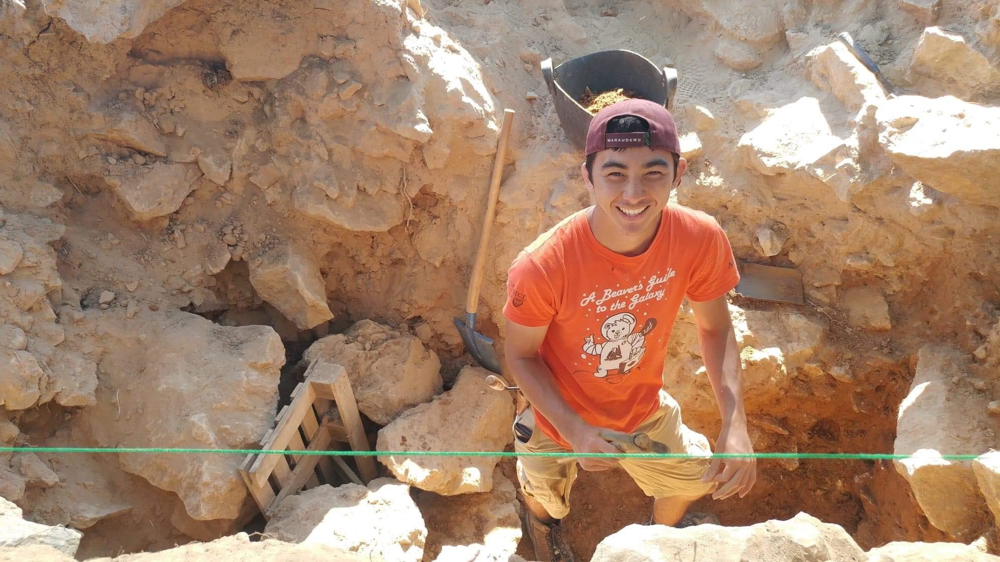
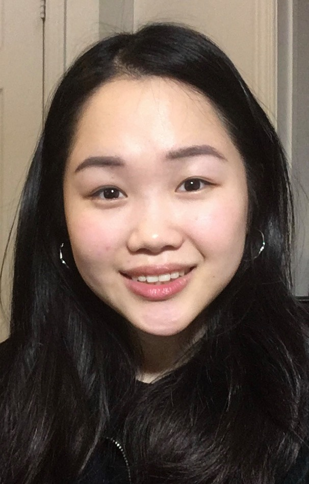

# GISB Crew

## Team Member Bios

 **David Zaslavsky**: Fifth year Biology/GIS student. My time at Mac and with GIS has been spent between ecology and conservation projects and public health GIS projects. Ready to finish off my degree and time as a student associate in the app challenge! 

 **Todd Wong**: Fifth year Anthropology and Geography student. My main focus is using GIS tools to perform analysis on Archaeological topics. I have been highly involved in GIS over the past 3 years and want my final year as a student associate to end off with a bang through this app challenge. 

 **Sherry Chen**: I am a 5th year undergrad studying Biology and Environmental Sciences with a minor in GIS and Chemistry. I am interested in using GIS to predict and estimate the effects of water levels and human settlements on coastal wetlands.
