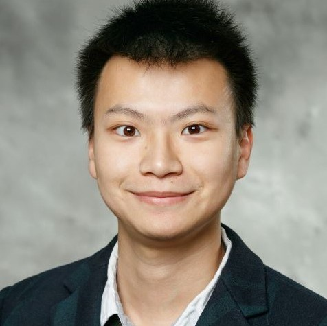
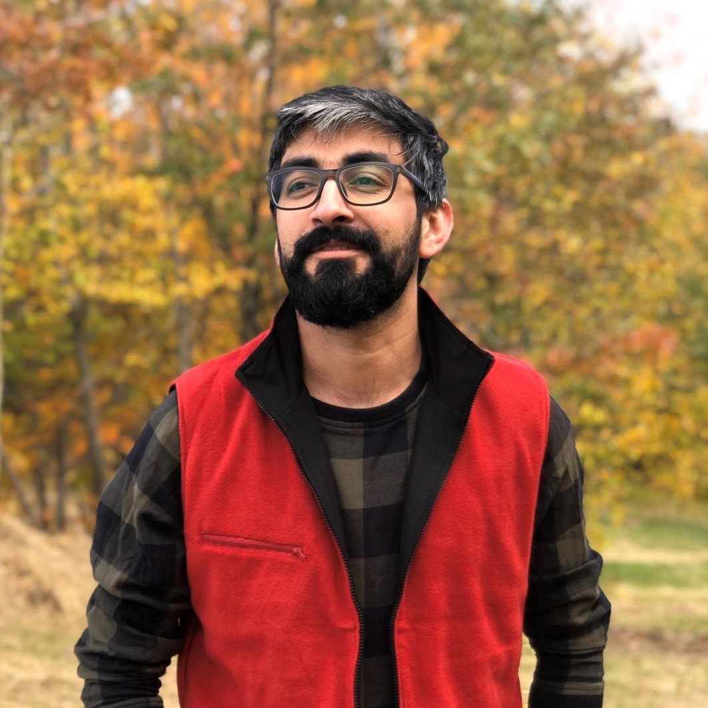
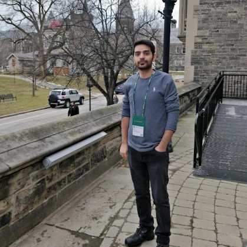

# The Predictors

## Team Member Bios

 **Xuyang Han**: Data Scientist and Full-stack Developer, han978@yorku.ca

Xuyang Han is a Master student in the Department of Earth and Space Science Engineering at York University. Data analytics and data mining with more than one year and a half of well-rounded experience. Built the first Crowd-sourced bathymetry database in North Canada Area. Applying Machine Learning Models to improve Marine Trajectory Clustering and Anomaly Detection. Skilled at GIS. Have experience on Full Stack Developing. Looking for an opportunity to work and upgrade, as well as being involved in an organization that believes in gaining a competitive edge and giving back to the community. 

 **Aman U. Usmani*: Software, Geomatics and Data Engineer, usmani@yorku.ca

Aman is a candidate for Master studies in department of Earth & Space Science Engineering at York University. After completing his undergrad in Computer Science, he joined the software development industry and polished skill set in Game Development. In 2018, he started research study with focused towards BIM, GIS and IoT oriented integrated system for smart cities application. Furthermore, his core skills is programming with best practices, and interests of software architectural designs, planning, development, analysis and optimization. 

 **Amirhossein Nourbakhsh**: Software, Geomatics and Data Engineer, amirnbr@yorku.ca

Amirhossein is a Master student in the Department of Earth and Space Science Engineering at York University. Experienced Computer Vision, Deep Learning, Network Analysis with a focus on Location Based Services .Skilled at Java, Node.js, MongoDB. Self-motivated and determined type which always ready to face the challenges with a problem-solving manner. try hard to stay away from the unhealthy and disturbing status quo of the society and do best to find ways to upgrade people and life to a higher level. 