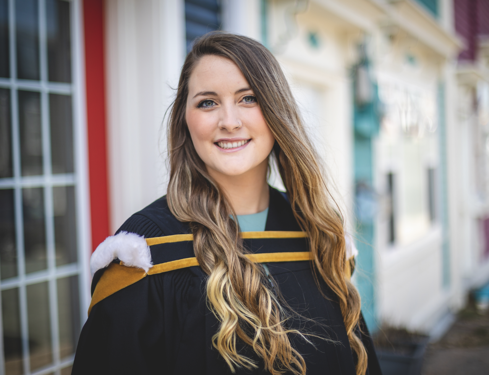
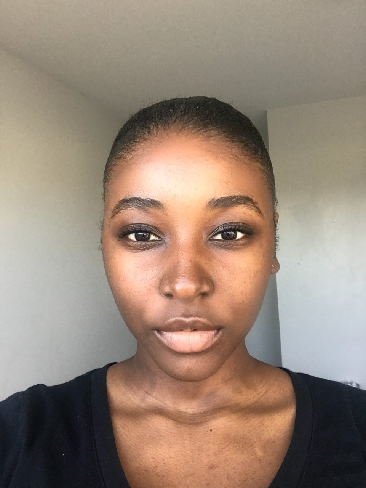
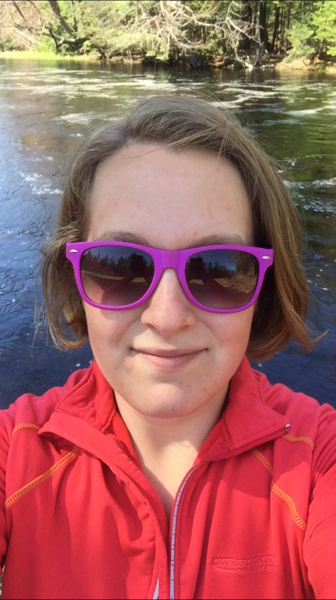

# Headspace

## Team Member Bios

 **Alysha Griffin**: Hi! I am a first year Master of Environmental Studies student at Dalhousie University. I previously completed my undergraduate degree with a major in Geography and Psychology. I have a passion for spatial and social science, and I hope to integrate both within my thesis research to the topic of connectivity conservation within Nova Scotia! I enjoy hiking, painting, and spending time with my dog, Arrow and cat, Peeko. I am excited to be part of this challenge and to learn more about the application of GIS to the topic of health. 

 **Rollajia Cooper**: Hi, I’m Rollajia Cooper. ESRI said, “Use your current GIS skills to create an app and you could win $500,” and I said, “Why not?” This app challenge is an exciting opportunity to put what I’ve learned about the tools and theories of spatial analysis to the test. This group, Headspace, can combine our different strengths and perspectives to create something that actually impacts people. At the end of it all I want to feel like, “Yeah... this is why I do... what i do.” 

 **Natasha Juckes**: Hello my name is Natasha Juckes. I am a third year student in the Bachelor of Community Design and am currently working on my GIS certificate at Dalhousie University. I am interested in how planning can impact human and environmental health. In my spare time I like to draw, blacksmith, and explore nature. This challenge will be an exciting way to see how GIS can help improve our health and I look forward to working with my team!
