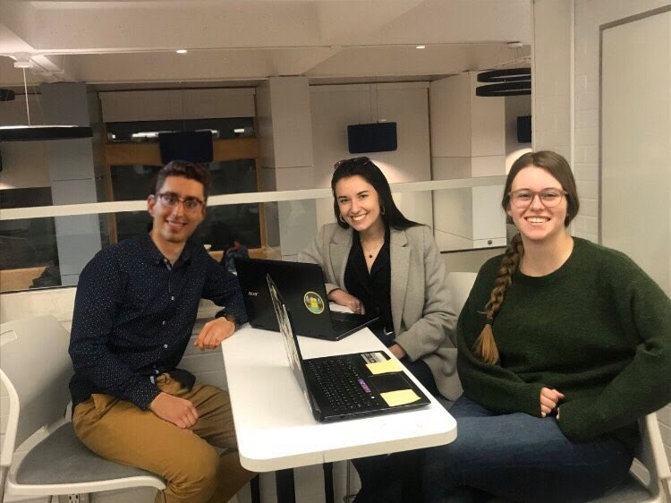

# Loeb Rats

## Team Photo

## Team Member Bios

**Erika Cizek** (right): My name is Erika, and I'm from Prague, Czech Republic. I'm currently in my third year in Human Geography with a minor in Geomatics at Carleton University. I'm currently beginning research for my Honours Thesis which will focus on issues surrounding affordable housing in rural areas around Ottawa. 

**Sabrina Ornawka** (middle): I am currently in my fourth year at Carleton University, where I am studying Geomatics, with a minor in Urban Studies. I have a passion for spatial data analytics, development and map-making! My favourite part about geomatics is having people with different backgrounds, knowledge, and specialties, come together in collaboration to use GIS for a variety of purposes and applications. When I'm not in class, at work, or in the GIS lab, I'm most likely somewhere outdoors or hanging out with my friends!

**Nicholas Pontone** (left): Hi everyone. My name is Nick, and I’m in my third year of Geomatics at Carleton University.  My areas of interest when it comes to geomatics and geography are spatial data science, remote sensing, and the cryosphere. This was my first year as an ECCE student associate. Participating in the app challenge was an exciting challenge that gave us the opportunity to push our skillset to its limits.

