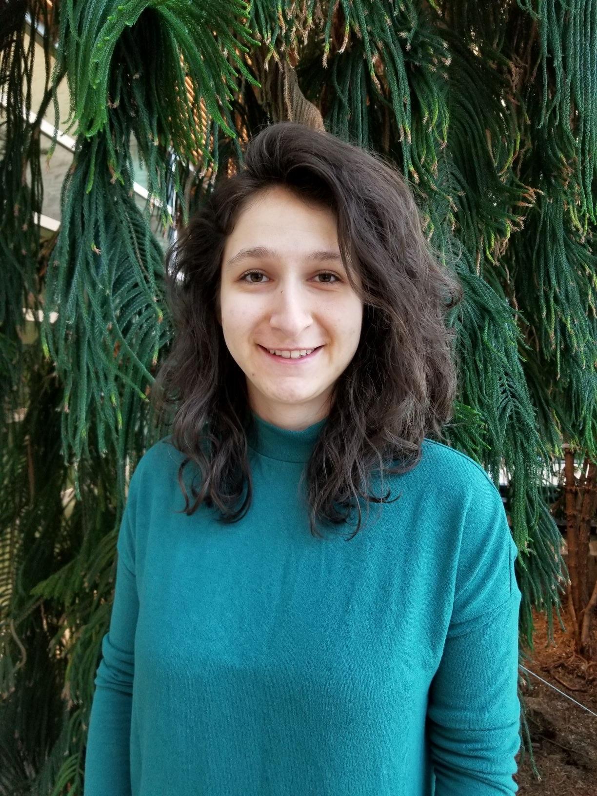
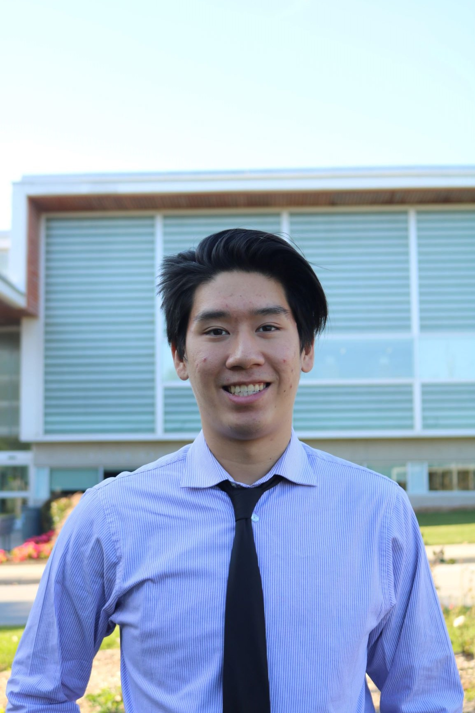
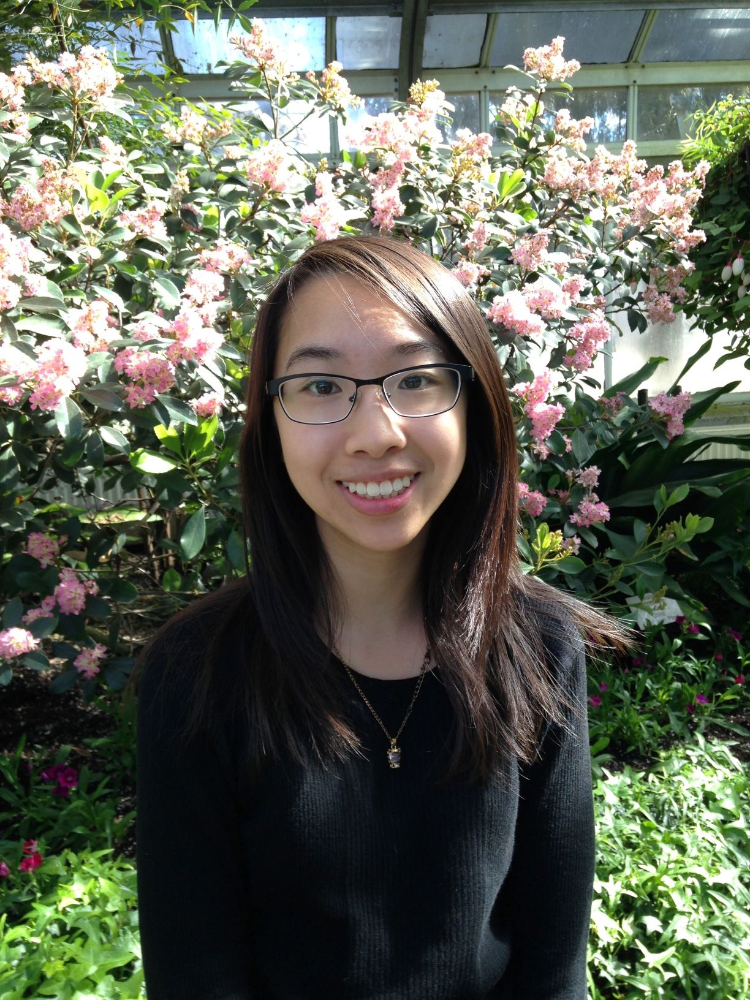

# MapMasters

## Team Member Bios

 **Maryrose D’Arienzo**: I am a 4th year undergraduate student in Honours Earth and Environmental Science pursuing a minor in GIS. I am interested in GIS applications to improve the social and environmental challenges we face, resulting from the coexistence of biodiversity, industry, and human population. The app challenge is an exciting opportunity to collaborate with my peers on current issues, as I am seeking challenges to apply my skills learned in the classroom. Additional hobbies include film photography, playing guitar, and hiking. 

 **Jason Lam**: I am a 2nd year undergraduate student in Honours Geography and Environmental Science pursuing a minor in GIS. I am currently enrolled in an advanced raster and remote sensing course and I plan on taking many more similar courses in the future. I am interested in pursuing a career specializing in GIS. My interest in this field was first sparked by multiple presentations done by Pat DeLuca in first year. I enjoy sports and online games in my free time. Being only in second year, I think this challenge is the perfect chance for me to work with peers above me and gain experience that will help me succeed in both my future classes as well as the workplace. 

 **Livia Nguyen**: I am a 4th year undergraduate student in the Honours Life Science program pursuing a minor in GIS. Throughout my studies, I have taken a variety of courses including Environmental Change & Human Health and Global Human Health & Disease which I hope to apply to this challenge. In the future, I would like to become a biomedical illustrator as I am interested in the visualization of science and data. Outside of class, I enjoy watercolour painting, sketching wildlife and playing video games.