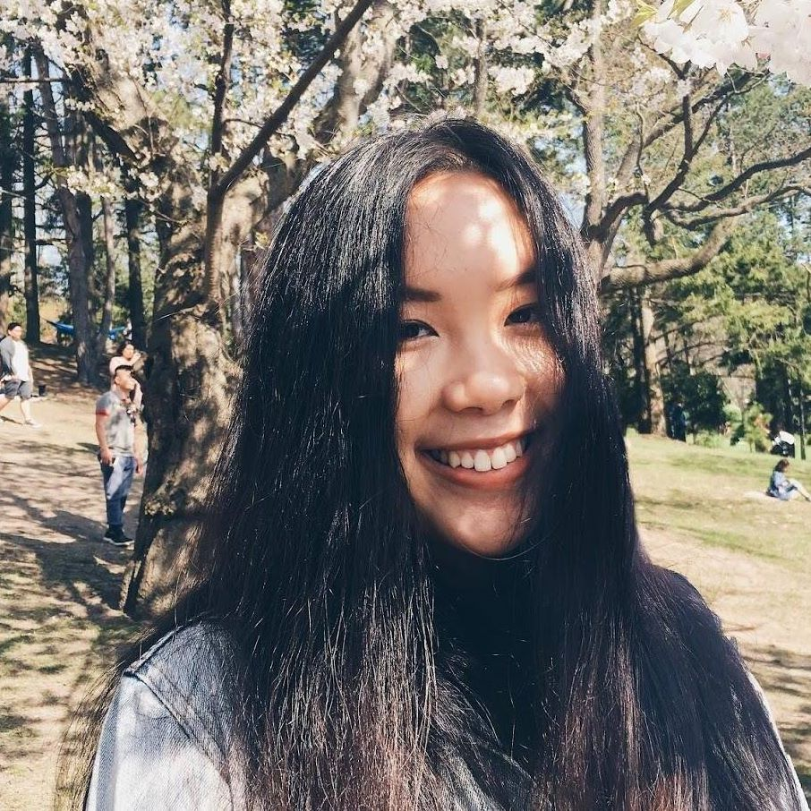

# QuaranTEAM

## Team Member Bios

 **Cathy Yang** is a 3rd year undergraduate student at U of T studying Physiology, Human Geography and GIS. She was the lead researcher and data curator for this project. Her interests lie in public health and assessing psychosocial barriers to healthcare access. Throughout this experience, she thoroughly enjoyed being able to merge her background and knowledge in healthcare and clinical research with the tools she has learned from her GIS courses. She  hopes in the future to be able to continue using geospatial technologies to help communicate and solve health problems. In her free time, she enjoys listening to podcasts, playing piano, and watching her favourite sports teams. 

 **Tia Datta** is a 3rd year undergraduate student at U of T studying Computer Science and Statistics. She helped with coding this app and enjoyed exploring the functionalities of ArcGIS Online and learning about spatial analysis techniques. She hopes to utilize these skills in future projects. Her hobbies include cooking, video games, and spending time with her cat. 

 **Chloe Nguyen** is a 1st year undergraduate student at U of T studying Computer Science. She was a developer for this project. She has an interest in data science and her hobbies include dance, martial arts, chess and piano.