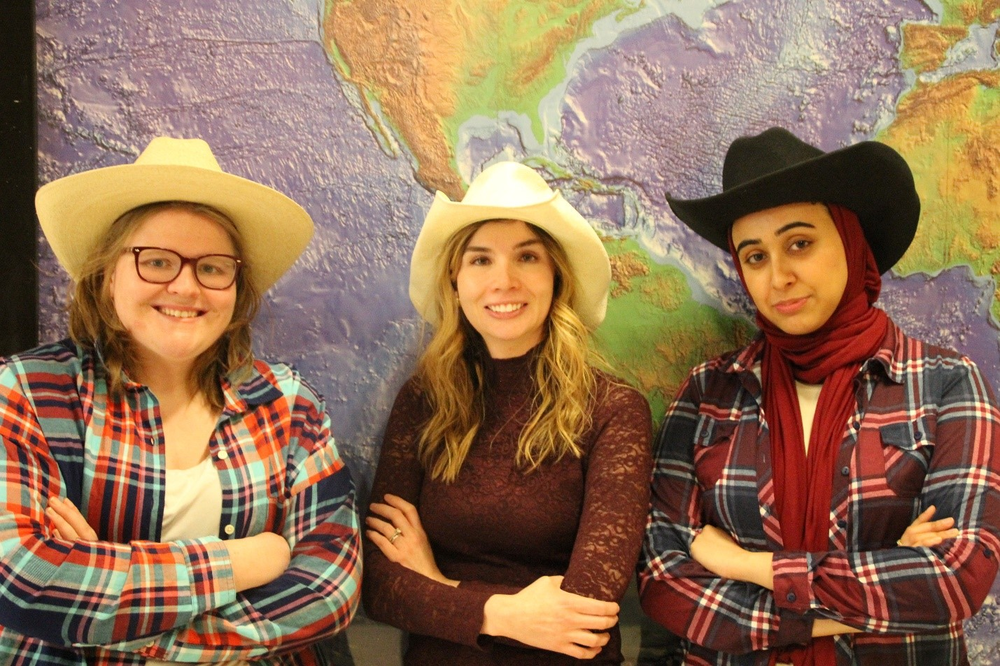

# Safe Routin' Cowgirls

## Team Photo

## Team Member Bios

**Nikki Rogers** (Middle) is a Master’s of Geographic Information Systems student researching the role of spatial analysis in understanding factors influencing pedestrian collisions. She believes that studying the spatial component of collisions is vital to improving commuter safety. She is passionate about equity in open data access across communities, municipalities, and regions. In her spare time she loves bike riding, traveling, and spending time with family.

**Shifa Hayat** (Right) is a Master of Science candidate in Geography researching how access to communities can be improved for people with mobility-related disability. Her past work has included using GIS technology and geospatial data to map accessible mobility features, assess sidewalk connectivity, and produce an access map for the university. Shifa is committed to making our built environment accessible for people with disability and volunteers on the City of Calgary Access Design Sub-committee. Shifa loves to spend her free time travelling with family, cooking up new recipes, or cuddling with her cats. 

**Alix Power** (Left) is a Master’s of Geographic Information Systems student studying predictive habitat modeling. She came to Calgary from Atlantic Canada, where she studied Biology and GIS, having also obtained an advanced diploma in geographic sciences with a GIS concentration. Alix has specific expertise in space-time analysis, which she was able to contribute to the creation of our application. In her spare time she loves to travel, hike, spend time near the ocean, and try new foods. 
