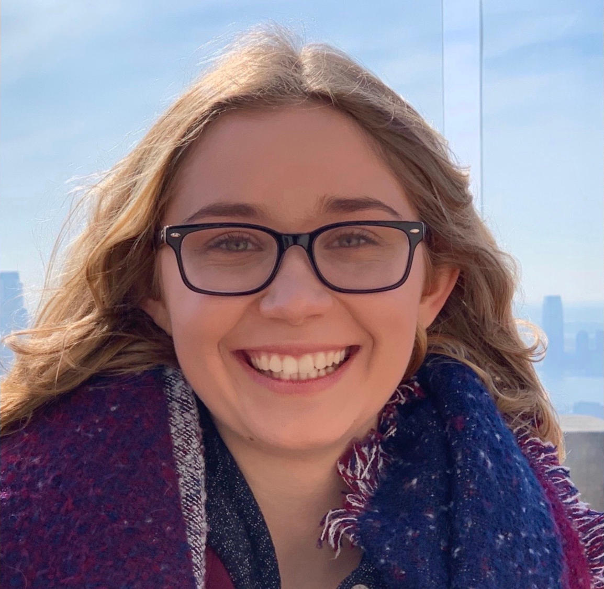
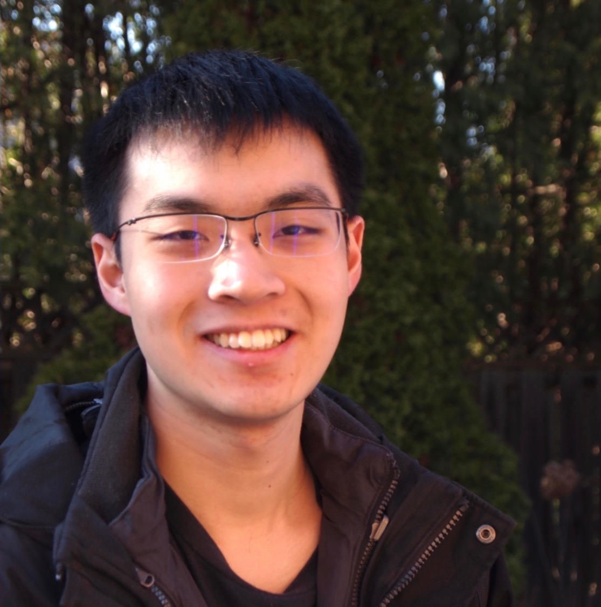

# The Predictors

## Team Member Bios

 **Pawel Midgal**: I am currently in my third year at the University of Toronto
Mississauga. I am doing a double major in Mathematics and Computer Science. I am
also doing a minor in Geographical Information Systems (GIS). My hobbies include
photography, skiing and snowboarding. 

 **Scarlett Rakowska**: Currently, I am in my third year of completing an Honours Bachelor of Science at the University of Toronto Mississauga. I am doing a double major in Geographical Information Systems (GIS) and Communication, Culture Information, and Technology (CCIT). In my free time, I love travelling and enjoying the outdoors. 

 **Ryan Wong**: I am a third-year student at the University of Toronto Mississauga. I am double majoring in Geographical Information Systems (GIS), and Communication, Culture Information, and Technology (CCIT). I am also doing a minor in Computer Science. On the side, I play the trumpet, and I enjoy camping.