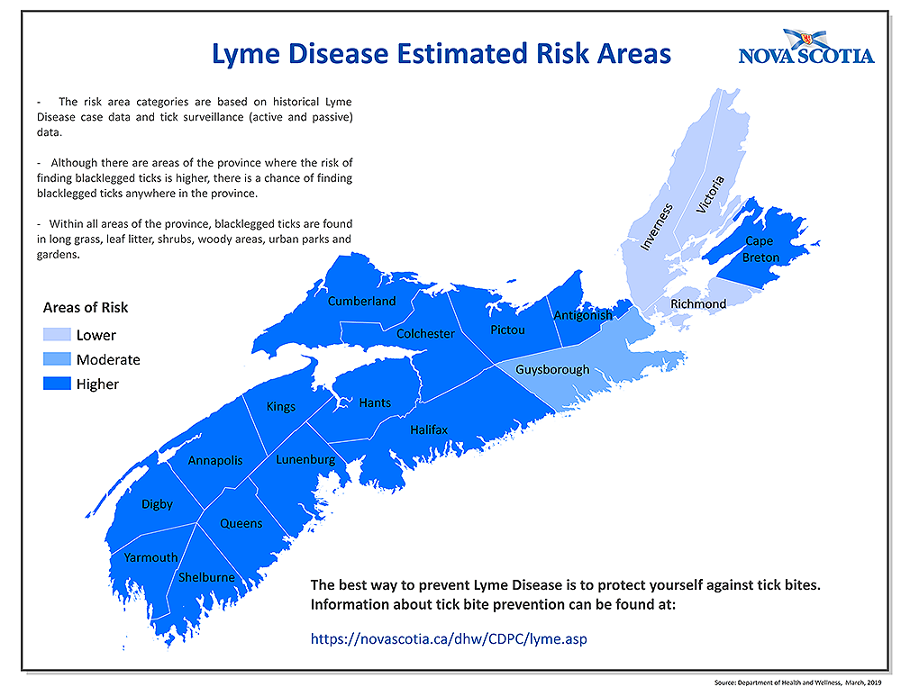

# Mapping Ticks in Nova Scotia
A Web app created by **The Wizards of COGS** for the 2020 Esri Canada Centres of Excellence App Challenge

### The Wizards of COGS is comprised of:
* Mikaila Bickford
* Peter Opra
* David Lefebvre 

## Mission Statement

The theme of this year’s ECCE App Challenge is Health. As health is a vast subject, our team decided to tackle a broad issue facing Nova Scotia – the transmission of Lyme Disease by ticks. Bringing together the health concerns of Nova Scotia residents and those facing our dear pets we wished to help lessen the burden of being aware of the presence of ticks in our environment before and after going outdoors. 

While ticks have been around for a very long time and have always been able to transmit disease, Lyme disease has a much shorter documented history. The first time it was diagnosed as a unique condition was in 1975 in Old Lyme, Connecticut, and for the most part the disease stayed within the borders of the United States. The official surveillance of cases of Lyme disease in humans began in 2009 and since then, the number of cases has drastically expanded northward to Canada. This is partly due to the expansion of blacklegged tick (Ixodes scapularis) populations within the country, spread via hosts (particularly birds) to suitable habitats where they thrive, and bring an onslaught of Lyme Disease cases with them. In fact, researchers have estimated a range expansion of between 35 km to 55 km Northward per year (Clow et al. 2017). Reported cases of Lyme disease have mirrored this expansion, increasing from 144 cases in 2009 to 2025 cases in 2017 (Ogden et al. 2019). 

Why should we care about Lyme Disease? Although the disease often goes untreated due to its novelty, it can have critical impacts on human health. The first symptom of Lyme disease is a rash - from 3 to 30 days after an infected tick bite, a rash (named erythema migrans) may expand slowly around the bite, and can spread to 30 centimeters across. However if left untreated, patients may experience bouts of severe joint pain and swelling, and even neurological problems, developing inflammation of the membranes surrounding the brain (meningitis), temporary paralysis of one side of their face (Bell's palsy), numbness or weakness in your limbs, and impaired muscle movement. Even after treatment, patients may experience post-treatment symptoms, which can include sleep disturbance, fatigue, muscle and joint pain, and mental confusion or inability to think clearly, with subtle cognitive changes (Government of Canada Public Health 2017). 

Consequently, the best treatment for Lyme Disease is tick bite prevention. Prevention measures include using insect repellents that contain DEET or Picaridin and wearing appropriate clothing (such as light-colored long pants and sleeves) when going outdoors, especially to tick-suitable habitats. However, avoiding tick populous areas is the most effective preventative measure you can take, a feat which is difficult in Nova Scotia – a province abounding with beautiful hiking trails, passionate naturalists, and black-legged ticks. In an effort to stay away from tick prone areas, the application lets the user visually interact with the Nova Scotia Lyme Disease risk assessment, as well as habitat-suitability and user-input tick sightings via citizen science. In this sense, as the app grows it will become more accurate and more useful.  

However, this app is only supposed to act as a guide and using it on its own will not prevent tick bites or Lyme Disease. Completing the steps to preventing tick bites after an outing is imperative - it is highly recommended to perform a tick check since the removal of any ticks in a timely manner will most likely prevent the transmission of the disease. If you do encounter a tick the application can be of use to easily document any encounters and help your local community in tick prevention.  

## App Characteristics

This web application tackles the issue of Lyme Disease in Nova Scotia - an increasingly significant, province wide health issue - by mapping tick density. By bringing awareness to the presence of ticks in our environment before and after going outdoors, we hope to empower users to empower each other. 

### Using Citizen Science as a powerful data collection tool 
Citizen science is a powerful data collection tool that engages the public with data collection and science. This web app compiles user submitted data on tick sightings to create a comprehensive map of tick density throughout Nova Scotia - in this case, the app will get better (and more accurate) with age! To submit a tick report, click on [this link](https://survey123.arcgis.com/share/0d735d3f194e41cf8a61c2aacbd01fa7) (also in the upper right corner of the app) - the form will ask you several questions about your experience, and plot your data.  

### Layers
All layers created for this app used open, Canadian data sets. Please feel free to explore the app by turning layers on and off within the layer tab, zooming in and out (as some layers are only visible if zoomed in), and clicking around the map to view in each area. Other layers included within the app are: 

* Reported ticks - iNaturalist user tick sightings, exported from [iNaturalist.org](https://www.inaturalist.org/)

* County Risk for Lyme Disease - Nova Scotia Open Data - *[Lyme Disease Risk by County](https://novascotia.ca/dhw/CDPC/lyme.asp)*

* Localized Areas of Risk for ticks, a habitat model for tick suitability developed using Ecological Land Classification Data (*[Nova Scotia Geographic Data Directory](https://nsgi.novascotia.ca/gdd/) 2015*) 

### Other App Features 

Planning a hike? Check out the Find Ticks Near Me widget in the right corner to find ticks in your local area or destination. Just curious? Click on the infographic tab and explore the map to see how many ticks have been reported within your screen's extent. 

## Data Sources

[iNaturalist, User tick sightings filtered by Location (Nova Scotia) (CSV). Nova Scotia, Canada: iNaturalist.org, exported March 2020](inaturalist.org)  

[Nova Scotia Department of Health and Wellness, Lyme Disease Estimated Risk Areas (Map). Nova Scotia, Canada: Government of Nova Scotia, 2019](https://novascotia.ca/dhw/CDPC/images/LymeDisease_County_Web_201903-1000.png) 

[Nova Scotia Geographic Data Directory, Ecological Land Classification (Shapefile). Nova Scotia, Canada: Government of Nova Scotia, 2018-11-08](https://nsgi.novascotia.ca/gdd/) 

[Nova Scotia Geographic Data Directory, County Boundaries (Shapefile). Nova Scotia, Canada: Government of Nova Scotia, 2018-05-03](https://nsgi.novascotia.ca/gdd/) 

## Meet the Wizards
### Peter Opra
Peter is a student at the Centre of Geographic Sciences, Nova Scotia Community College, who is pursuing an Advanced Diploma in GIS. He has a background in Geology, having graduated from Saint Mary’s University and mapped legacy gold mine tailings in Nova Scotia’s Historic Gold Districts. He is passionate about the earth, the processes that formed and shape it to the present day. He believes with GIS we can document resources and create maps that can tell a story. He enjoys the great outdoors, exploring, and always learning. I am a geologist surfing the waves of a geospatial world. 

### Mikaila Bickford
Mikaila is a student at the Centre of Geographic Sciences, Nova Scotia Community College, who is pursuing an Advanced Diploma in GIS. Her background is in both anthropology and marine management, holding a BA(Hons.) from University of Toronto and an MMM from Dalhousie. She is passionate about ocean conservation and maps, and loves the way GIS combines technology with creativity and design. She believes that documenting our relationship with the ocean and coastal zone through GIS and can have profound future impacts. When she's not in the lab, you can find Mikaila diving, hiking, taking photos, or eating oysters. 

### David Lefebvre
David is a student at the Centre of Geographic Sciences, Nova Scotia Community College, who is pursuing an Advanced Diploma in GIS. He is currently studying on geographic science systems (GIS) in the GIS concentration. Before coming here he studied Environmental Geography at the University of Montreal in the province of Quebec and Geomatics at the Algonquin College of Ottawa, in Ontario. Since then for the last 5 years, he has worked as a Geomatic Technician for the Canadian Armed Forces and was given the opportunity to return to school to further my knowledge in the field of geomatics and GIS. His pastimes mostly involve outdoor sports and activities such as hiking, biking, climbing (Ice & Rock) and trail running, but he also partakes in group sports such as volleyball. 

##References 
Clow KM, Leighton PA, Ogden NH, Lindsay LR, Michel P, et al. (2017). Northward range expansion of *Ixodes scapularis* evident over a short timescale in Ontario, Canada. *PLOS ONE* 12(12): e0189393. [https://doi.org/10.1371/journal.pone.0189393](https://doi.org/10.1371/journal.pone.0189393)

Government of Canada. (2017). Symptoms of Lyme Disease. Public Health. [Accessed March 2020](https://www.canada.ca/en/public-health/services/diseases/lyme-disease/symptoms-lyme-disease.html)

Ogden, N.H., Bouchard, C., Badcock, J. et al. (2019). What is the real number of Lyme disease cases in Canada?. *BMC Public Health* 19, 849. [https://doi.org/10.1186/s12889-019-7219-x](https://doi.org/10.1186/s12889-019-7219-x)

R. M. Nadolny & H. D. Gaff (2018). Modelling the effects of habitat and hosts on tick invasions, Letters in Biomathematics, 5:1, 2-29, DOI: [10.1080/23737867.2017.1412811](https://www.tandfonline.com/doi/citedby/10.1080/23737867.2017.1412811?scroll=top&needAccess=true)

Photo Source: [Global News 2018](https://globalnews.ca/news/4197168/tick-forecast-lyme-disease-canada-2018/)
