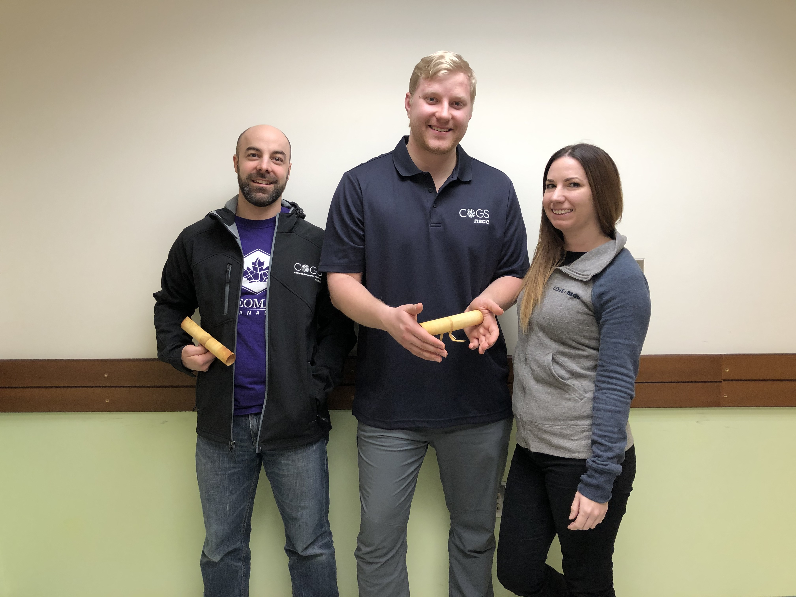

# The Wizards of COGS

## Team Photo

## Team Member Bios

**Peter Opra** (middle): Peter is a student at the Centre of Geographic Sciences, Nova Scotia Community College, who is pursuing an Advanced Diploma in GIS. He has a background in Geology, having graduated from Saint Mary’s University and mapped legacy gold mine tailings in Nova Scotia’s Historic Gold Districts. He is passionate about the earth, the processes that formed and shape it to the present day. He believes with GIS we can document resources and create maps that can tell a story. He enjoys the great outdoors, exploring, and always learning. I am a geologist surfing the waves of a geospatial world.

**Mikaila Bickford** (right): Mikaila is a student at the Centre of Geographic Sciences, Nova Scotia Community College, who is pursuing an Advanced Diploma in GIS. Her background is in both anthropology and marine management, holding a BA(Hons.) from University of Toronto and an MMM from Dalhousie. She is passionate about ocean conservation and maps, and loves the way GIS combines technology with creativity and design. She believes that documenting our relationship with the ocean and coastal zone through GIS and can have profound future impacts. When she's not in the lab, you can find Mikaila diving, hiking, taking photos, or eating oysters.

**David Lefebvre** (left): David is a student at the Centre of Geographic Sciences, Nova Scotia Community College, who is pursuing an Advanced Diploma in GIS. He is currently studying on geographic science systems (GIS) in the GIS concentration. Before coming here he studied Environmental Geography at the University of Montreal in the province of Quebec and Geomatics at the Algonquin College of Ottawa, in Ontario. Since then for the last 5 years, he has worked as a Geomatic Technician for the Canadian Armed Forces and was given the opportunity to return to school to further my knowledge in the field of geomatics and GIS. His pastimes mostly involve outdoor sports and activities such as hiking, biking, climbing (Ice & Rock) and trail running, but he also partakes in group sports such as volleyball.

