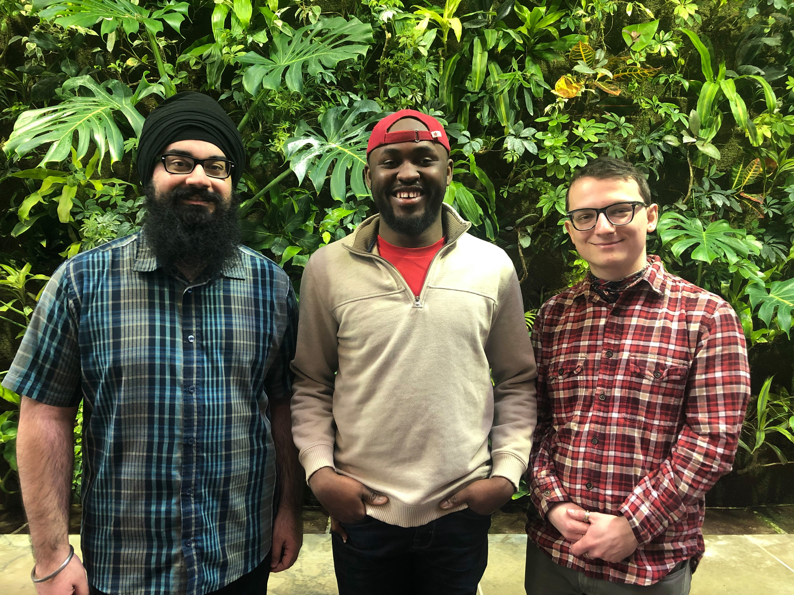

# UPHILL Climbers

## Team Photo

## Team Member Bios

**Manpreet Chahal** (left): 
I was the Lead Data Scientist for the team. I am completing my Master’s in Geography, working with Public Participation GIS and Heritage Planning at the University of Waterloo. I completed my undergraduate degree in Biology and Environmental Science with a minor in GIS at McMaster University. My background in using GIS technology in my undergraduate thesis and thus far in my Masters thesis has given me the experience to gather, clean, organize, and analyze the data for the app. In my spare time, I enjoy playing sports such as basketball and soccer and watching hockey.

**Robert Arku** (middle): 
I was the Lead Researcher for the team. I am a 2nd year Urban Planning Master’s student at the  University of Waterloo (UW). I earned my undergraduate degree, BSc. Land Economy, at the Kwame Nkrumah University of Science and Technology (KNUST). Currently at UW, I am involved in a planning project which focuses on using participatory mapping to inform urban intensification projects. Past academic and research experience has equipped me with research and analytical skills which were used in this project. My hobbies include watching and playing football, and playing musical instruments specifically the piano and guitar.

**Misha Kusma** (right): 
I was the Lead Analyst and Data Visualizer for the team. I am completing my Bachelors in Environmental Studies in Geomatics with a Minor in Computer Science at the University of Waterloo. I have had the pleasure in using GIS and data science technology in a variety of workplaces including at the University as a research assistant, at the Ministry of Agriculture as part of the business support team, and at Statistics Canada as part of the elections registrar. My hobbies are game development, art, and animation.