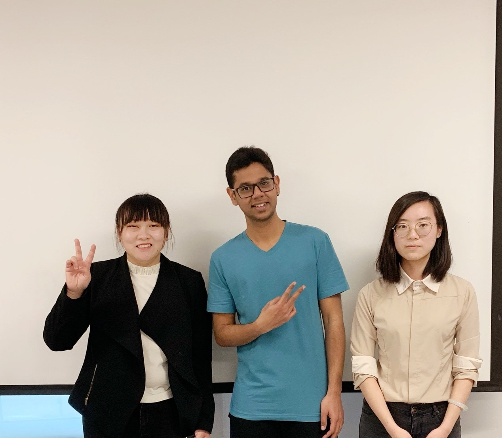

# You Know Who

## Team Photo

## Team Member Bios

Yizhi Huang (left) is a MSc student in the Geomatics Engineering Department at University of Calgary. Her research is related to Geographic Information System. She received her BSc degree in school of Resources and Environment from University of Electronic Science and Technology of China, Chengdu, China.

Lingyi Cui (right) received her BSc degree in Geomatics Engineering department at University of Calgary in 2019 and is now a first-year master student at the same department. She has an interest in GIS applications that benefits everyday life. Lingyi enjoys challenge herself to learn new skills and technologies.

Vivek Suresh Raj (middle) is a first year MEng student in geomatics engineering from University of Calgary. He has completed his Bachelor’s in Electrical and Electronics Engineering from KCT, India in 2017. His final year project in Bachelor’s was a prototype of a wheel chair controlled by android application through facial recognition system. He is current doing his specialization in Spatial Database and Analytics.
